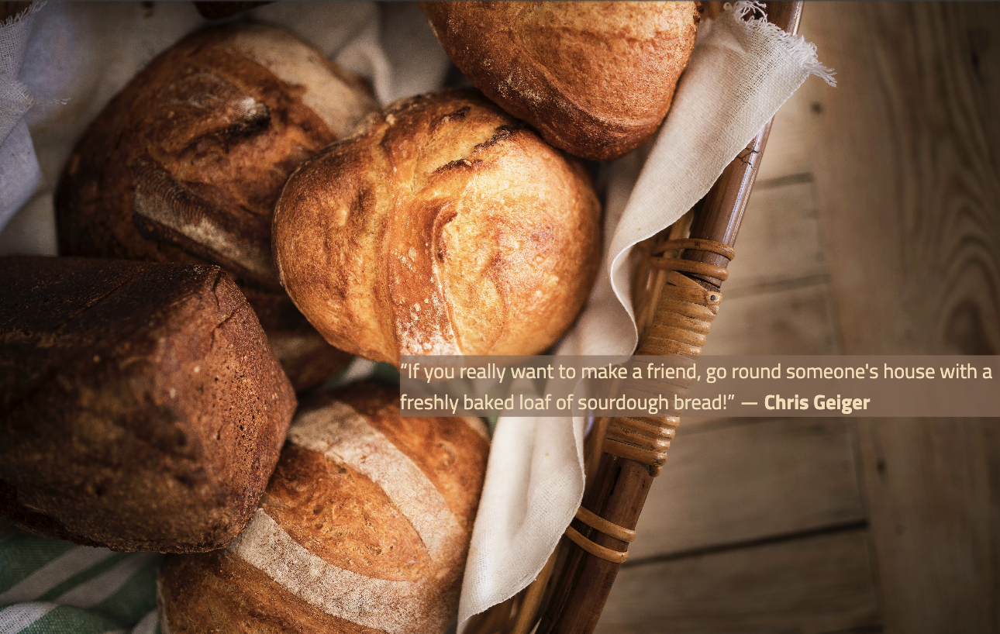

# SOURDOUGH ENTHUSIASTS
Sourdough Enthusiasts is a site for those who have a hunger and a passion about baking sourdough bread. It is aiming to inform the user with related information to the subject, such as the history of sourdough bread, the health benefits of consuming it and step-by-step video tutorials of the fundamental knowledge required. This website will be targeted to adults over the age of 20 who either wish to find out more information about sourdough bread or even get involved and start cultivating their own sourdough starter and baking their very own loaves of bread.

## **Features**
### *Existing Features*
- __Navigation Bar__
    - The navigation bar is fully responsive and allows the user to navigate to all three pages (Home, Gallery and Get Involved) and the Logo (SOURDOUGH ENTHUSIASTS) which takes the user to the home page.
    - It is featured in all three pages of the website.
    - It provides the user with easy navigation on all screens with the pages being displayed in a single row on tablet screens and larger. For mobile screens the pages list can be displayed by clicking on the icon at the top right of the screen.

    **Mobile Screens:**

    **Table Screens and Larger:**

- __Landing Page__

    - The image on the landning page and the quote help provide the user with an idea of what the website will be related to. 
    - It is a very minimalistic section compared to the other sections and aims to encourage and inspire users to dive into the details of sourdough bread.

- __The History of Sourdough Section__

    - This section icludes an article about the origins and evolution of sourdough bread. Helps the user deepen their knowledge and understanding of this specific subject.
    - The frame that the article is placed inside allows the user to scroll up or down offering a convenient experience of navigation throught the website.
    - The article includes various images that are related with the history of sourdough.
    - The contrast between the background image and the article was intentional and is aiming to offer better readability.

- __Health Benefits of Sourdough Section__

    - This section includes an informative article about the health benefits that sourdough has to offer.
    - To maintain consistency over the site this section also allows the user to scroll up and down in order to navigate through the article.
    - Contrast between the background and the article has been used here as well for readability purposes.

- __Tutorials Section__

    - This section include two fundamental tutorials necessary for the creation of a traditional sourdough bread.
    - It encourages the user to get involved by providing step-by-step guidance, the videos are simple to understand and the instructions useful to those interested in participating in bread-making.

- __The Footer__

    - The footer includes the icons to the social media pages and each icon opens in a new tab on the browser.
    - It lets the user access and get connected with the websites social media.

### *Features to be added in future*
## **Testing**
### *Validator Testing* 
### *Unfixed Bugs* 
    - If any.
## **Repository and Workspace Set Up**
-  Creating a repository on Github.com:
    - Click on the Repositories tab.
    - On the top right-hand corner there is a green button that says "New", click on that.
    - Give the new repository a name, "sourdough-enthusiasts" in this case.
    - Ensure the repository is public by clicking on the Public button under the Description field.
    - Click on the Add README file in order to have this file included automatically.
    - Lastly, at the bottom right-hand corner click on "Create repository".
    - The new repository should be now available on the repositories tab on Github.

- Creating a workspace on Codeanywhere.com:
    - Login to your account, in this case I logged in using my github account.
    - On the workspaces tab click on the "New Workspace".
    - Go back to your Github repositories page and find the repository you want to create a workspace for, in this case, sourdough-enthusiasts.
    - Click on the repository and inside of it at the top right-hand corner there is a button that says "Code".
    - Click on the code button and copy the https URL from it.
    - Paste this URL in codeanywhere inside the "Create from your project repository" field.
    - Click on the bottom right-hand corner the green button that says create.
    - After a little while the workspace should be up and running.

## **Deployment** 
The website was deployed using Github.com. 
- The steps followed were: 
    - In the github repository (sourdough enthusiasts) click on the Setting tab, right under the search bar.
    - On the left hand-side of the page click on Pages inside the Code and Automation section.
    - Ensure the source is selected as "deploy from branch" and the branch is set to "main".
    - Once the main branch is selected the page should be deployed automatically. It will display at the top of the page that the site is deployed and indicate the link to access the site.

The live link of the website is: https://alexiou981.github.io/sourdough-enthusiasts/ 

## **Credits**
### *Content*
- As a starting point of creating this website and to help me get a better idea in terms of structure and layout I used the Love Running project index.html and style.css files. The links to the files can be found here: [HTML](https://github.com/Code-Institute-Solutions/love-running-v3/blob/main/3.7-creating-the-footer/index.html) and [CSS](https://github.com/Code-Institute-Solutions/love-running-v3/blob/main/3.7-creating-the-footer/assets/css/style.css) both provided by AJGreaves. 

- Additional sources of guidance were [W3Schools](https://www.w3schools.com/), [Stack Overflow](https://stackoverflow.com/) and loads of support advice and costructive feedback from my mentor Lauren-Nicole.

- The [quote](https://www.goodreads.com/quotes/tag/sourdough) on the home page of the website was provided by _Chris Geiger_.

- This [article](https://www.sourdough.co.uk/the-history-of-sourdough-bread/) about the history of sourdough bread was written by Vanessa Kimbell.

- The health benefits section was taken from this [article](https://www.medicalnewstoday.com/articles/about-sourdough-bread) written by Louisa Richards.

### *Media* 
- The photo used for the [favicon](https://www.pexels.com/photo/freshly-baked-golden-loaf-on-white-surface-6605209/) was taken from an open-source website and it was uploaded by _Geraud Pfeiffer_.

- The images used for the Gallery page were taken from three different open-source websites, pexels, unsplash and pixabay. Links to the original images along with the owners name can be found below:

   - Raw dough with flour and ingredients on table [image](https://www.pexels.com/photo/raw-dough-with-flour-and-ingredients-on-table-6605210/) uploaded by _Geraud Pfeiffer_ 
   - Person Holding White Dough in Close-up Photography [image](https://www.pexels.com/photo/person-holding-white-dough-in-close-up-photography-10009354/) by _Skyler Ewing_
   - A Person Shaping a Lump of Dough [image]( https://www.pexels.com/photo/a-person-shaping-a-lump-of-dough-10009355/) by _Skyler Ewing_
   - Girl Kneading Dough [image](https://www.pexels.com/photo/girl-kneading-dough-5119851/) by _Arina Krasnikova_ 
   - Person Holding Clear Glass Bowl [image](https://www.pexels.com/photo/person-holding-clear-glass-bowl-5947594/) by _Roman Odintsov_
   - Fresh Dough in a Bowl [image](https://www.pexels.com/photo/fresh-dough-in-a-bowl-7235852/) by _Eva Bronzini_ 
   - Hands With Dough Crumbles [image](https://www.pexels.com/photo/a-person-kneading-a-dough-in-a-bowl-6996191/) by _Pavel Danilyuk_ 
   - The Inside of a Bread Cut In Half [image](https://unsplash.com/photos/UQsFG9u94NI) by _Vicky Ng_
   - White Ceramic Mug Beside Clear Glass Bowl [image](https://unsplash.com/photos/E5xgkSFan84) by _Anshu A_ 
   - Sourdough Starter Inside a Clear Glass [image](https://unsplash.com/photos/3OqUddEfRZc) by _Margaret Jaszowska_
   - Baked Loaf Unscored in a Dutch Oven [image](https://unsplash.com/photos/d5ZViboCjm0) by _Vince Lee_
   - Starter at its Optimal Point [image](https://pixabay.com/photos/bread-food-bake-bakery-wheat-2559313/) by _Thomas Bock_
   - White and Black loaves on table [image](https://www.pexels.com/photo/white-and-black-loaves-on-table-7693917/) by _Marta Dzedyshko_
   - Fresh Bread on Wooden Cutting Board [image](https://www.pexels.com/photo/fresh-bread-on-wooden-cutting-board-7693957/) by _Marta Dzedyshko_
   - Slices of Sourdough Bread on Black Ceramic Plate [image](https://www.pexels.com/photo/slices-of-sourdough-bread-on-a-black-ceramic-plate-4881593/) by _Jytte Elfferich_
   - A Person Holding a Crusting Loaf of Bread [image](https://www.pexels.com/photo/a-person-holding-a-crusty-loaf-of-bread-10011795/) by _Skyler Ewing_
   - Fresh bread in basket placed on wooden surface [image](https://www.pexels.com/photo/fresh-bread-in-basket-placed-on-wooden-surface-6794615/) by _Piotr Arnoldes_

- The videos used for the tutorial section were [starter tutorial](https://www.youtube.com/watch?v=4nh4Z0EncGk&ab_channel=ChefStudio) by Chef Studio and [bread tutorial](https://www.youtube.com/watch?v=4r8irdLuUtc&ab_channel=CulinaryExploration) by Culinary Exploration.
